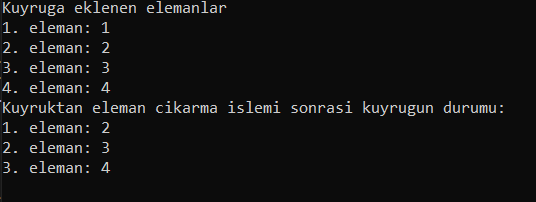
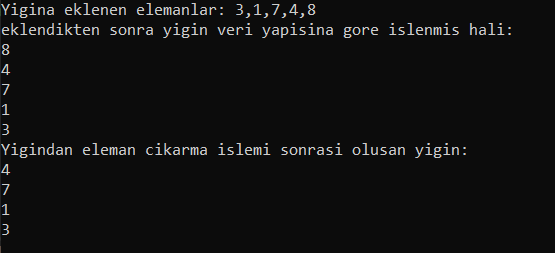
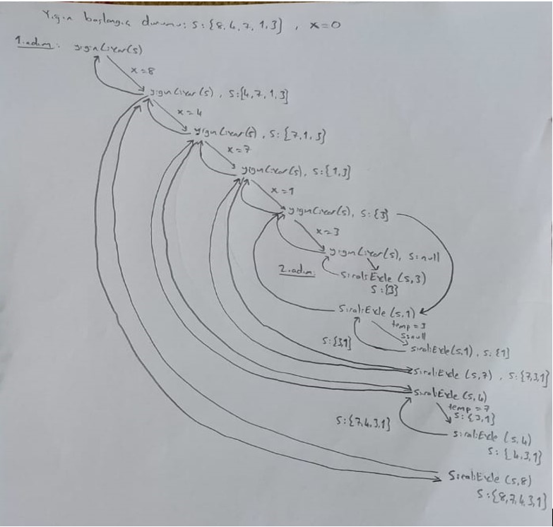

<h1>Veri Yapıları Ders Ödevi</h1>

Veri yapıları dersimizin bu ödevinde kuyruk ve yığın veri yapıları kullanılarak üzerlerinde ekleme, çıkarma, sıralama işlemleri gerçekleştirildi. Kuyruk ve yığın veri yapılarından kısaca bahsedecek olursak; 
Kuyruk veri yapısı, ilk giren ilk çıkar son giren son çıkar mantığı ile çalışmaktadır. Bu veri yapısına fırında ekmek için sıra bekleyen insanları veya bir markette sırada bekleyen insanları vs. örnek verebiliriz. Bu veri yapısına iki kısımdan erişim vardır. Yeni gelen elemanların eklenecekleri konumu işaretleyen bir son işaretçisi ve sırada aktif olanı belirlemek üzere bir de baş işaretçisi bulunmaktadır. Kuyrukda eleman ekleme işlemi(enqueue) kuyruğun sonuna, eleman çıkarma işlemi(dequeue) ise kuyruğun başına yapılır. Yığın Veri Yapısı ise ilk giren son, son giren ilk çıkar mantığı ile çalışır. Buna ise bir kutuya konulan kitapları örnek verebiliriz. Bu veri yapısında eleman ekleme işlemi(push) yığının en üstüne gerçekleşirken, eleman çıkarma işlemi(pop) ise yine yığının en üstünden gerçekleşir. 

 

Yığın veri yapısındaki elemanları büyükten küçüğe doğru sıralamak için ÖzYinelemeli Fonksiyonlar Kullandım.( void yiginCikar(Yigin* s); , void siraliEkle(Yigin* s, int x);) 

Bu fonksiyonlar temelde; 
yiginCikar özyinelemeli fonksiyonu, yığını teker teker boşaltır.
siraliEkle özyinelemeli fonksiyonu ise yığında sıralama işlemi yapar.

<b>yiginCikar özyinelemeli fonksiyonu çalışma mantığı:</b> Bu fonksiyon,kendine bir stack’in adresini alıyor,sonra stack bos olmadığı sürece stack’deki veriyi alıp daha sonra stack’den o veriyi çıkarıyor,bu işlemi rekürsif olarak stack boş olana kadar tekrar ediyor. Ardından sıraliEkle fonksiyonuna geçiyor.

<b>siraliEkle özyinelemeli fonksiyonu çalışma mantığı:</b> Bu fonksiyon ise,kendine bir stack,birde stack’de bulunan verileri alıyor. Stack bos veya alınan her bir deger stack’in tepesindeki değerden büyük ise o değeri tepeye alıyor. Eğer bu şart sağlanmazsa stack’in tepesindeki değeri cikarip, alinan x değerini tepeye yerleştirene kadar kendi içinde rekürsif dolaşıp ardından x değerini yerleştirdikten sonra cikardigi değeri tepeye koyup tekrardan rekürsif olarak bu durumları tekrar ediyor.

<h3>1. Kullanılan Teknolojiler ve Dil:</h3> Visual Studio Console Application - C++
  

<h3>2. Yığın Sıralama Calışma Mantığı</h3>

<h3>3. Veri Yapıları ve Değişkenler</h3>

Ödevi geliştirirken Yığın ve kuyruk veri yapısını kullandım.  Kuyruk veri yapısını, geliş sırasına göre hizmet verilmesi gereken durumlarda fayda sağlaması için kullandım. Yığın veri yapısını ise, son eklenen elemana ve sonrakilere daha düzenli ve uygun bir şekilde erişmek için kullandım.

<h3>4. Sonuç</h3>

Ödevi geliştirirken kuyruk, yığın veri yapısı ve özyinelemeli fonksiyonların ne şekilde çalıştığı, yığın veri yapısını kuyrukla beraber nasıl kullanıldığını görüp deneyim, tecrübe kazandığımı söyleyebilirim.

